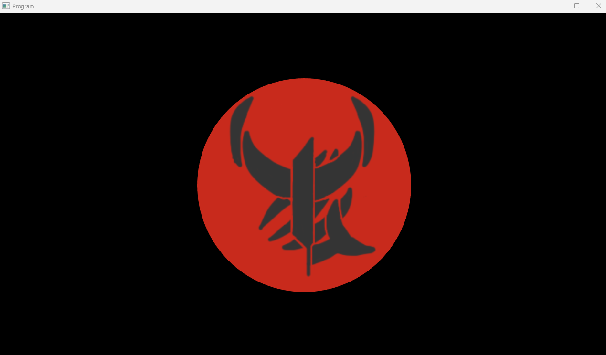
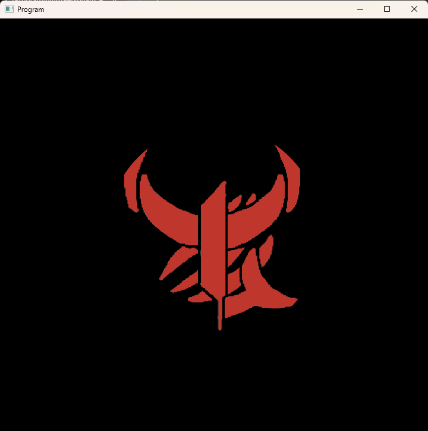
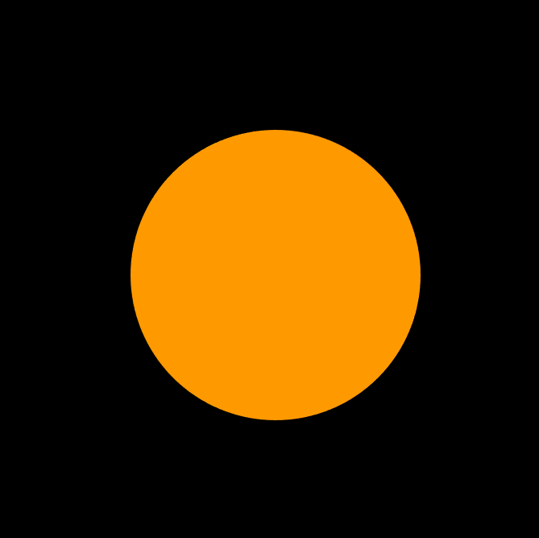
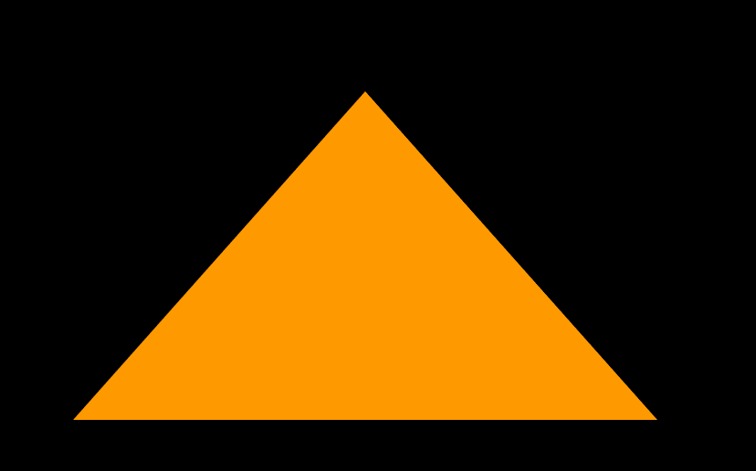
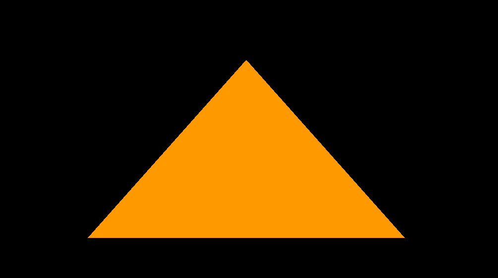

# Overview
This program was created to help me learn OpenGL. I followed this tutorial for the majority of the programming (https://www.youtube.com/playlist?list=PLlrATfBNZ98foTJPJ_Ev03o2oq3-GGOS2) however some things (most notibly the circle generation code) were done entirely by myself. 

Since each stage builds off of each other not all screenshots below are generatable with the current program. Screenshots from the current program are marked separately from legacy screenshots for this reason.

Project is left in visual studio format since it's a learning project and not an independent program I'd expect other people to want to run

# Current Screenshots:

Screenshot shows the circle being correctly rendered and moved through the use of a view matrix

<video controls src="ScreenRecords/MovingCircle.mp4" title="Title"></video>

Screenshot below shows the textured circle being correctly rendered on a non square display. Achieved via the use of an orthographic projection matrix

# Legacy Screenshots:

Screenshot below shows my first textured object. The texture is rendered over a circle (although it's not obvious from the screenshot)

Screenshot shows my orange circle generated using 129 verticies and appropriate indexes (allowing the circle to be rendered without data duplication)

Screenshot showing an orange triangle with smoothed edges due to enabling MSAA

Screenshot showing an orange triangle with rough edges

